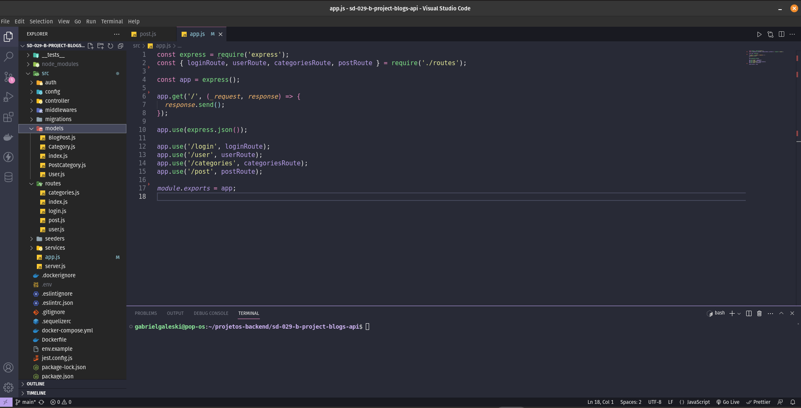

# :computer: API Blogs! :computer:

 

# :camera_flash: Imagens do Projeto

  
  

 

# :clipboard: About
O Projeto tem como objetivo as construção de uma API Restful, utilizando arquitetura MSC e o Sequelize. A API trata de gerenciar um blog, onde é possivel se registrar como usuario, realizar post, logar, deletar, atualizar entre outros eventos, tudo conectado com o banco de dados no MySQL. O Gerenciamento é feito pelo Express junto do Sequelizer, evitando comandos com escrita direto no banco de dados, dando mais estrutura e confiança na aplicação.

 

# :hammer_and_wrench: Skills & Tools

- Node.js
- Express
- Javascript
- Sequelize
- MySQL
- Docker
- Docker Compose
- EsLint
- Arquitetura de camadas (MSC)
- JWT

 

